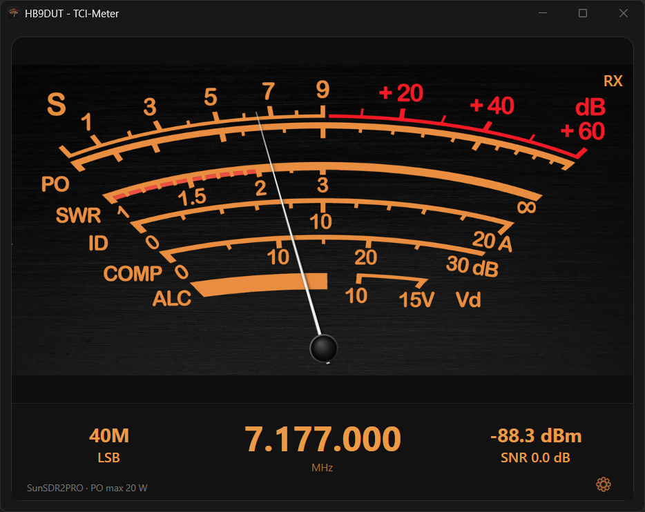

# TCI-Meter

English · [Deutsch](README.de.md)

An analog-style S / PO / SWR meter for transceivers with a [TCI interface](https://github.com/ExpertSDR3/TCI)
(Expert Electronics, e.g. SunSDR with ExpertSDR3) – for Windows.

While **receiving** the needle shows the S-meter reading. While **transmitting** (including Tune) it shows either the
output power or the SWR, as you prefer. Band, mode, frequency, signal level and SNR are displayed below the meter.
All data is read live over TCI.

  

## Installation

1. Download the latest `TciMeter-Setup-x.y.z.exe` from [**Releases**](https://github.com/HB9DUT/TCI_Meter/releases/latest).
2. Run the file and follow the wizard.
   - **No administrator rights** are required; by default the app is installed for the current user only.
     Installing for all users is possible on request.
   - **No .NET installation** is needed.
   - A desktop shortcut is optional; a Start menu entry is always created.
3. On first start, set up the connection to your transceiver (see below).

**Note on Windows SmartScreen:** the installer is not digitally signed, so Windows may show
"Windows protected your PC" on first launch. Click **More info → Run anyway** to continue.

Requirements: Windows 10 or 11 (64-bit).

## First start

The TCI server must be enabled in your transceiver software (e.g. ExpertSDR3). By default the meter connects to
`localhost`, port `50001`. If the software runs on another computer, change the address under **Settings**.

While there is no connection, the bottom left shows "Connecting to …"; the meter reconnects automatically as soon as the
server is reachable.

## Usage

- **Settings:** gear icon at the bottom right, or right-click the meter.
  - *Callsign* – shown in the window title ("HB9XYZ - TCI-Meter")
  - *Language* – English or German; *Auto* follows the Windows display language
  - *Host / Port* of the TCI server
  - *Receiver / Channel* – which receiver and VFO are displayed (0 = A, 1 = B)
  - *PO max (W)* – full-scale value of the power reading, matching your radio's output power
  - *Transmit (incl. Tune)* – the needle shows the output power **or** the SWR
- **Right-click menu:** Settings, *Always on top*, Info
- Settings are stored per Windows user and are kept when you update.

The **SNR** is an estimate: TCI only provides the signal level, so the noise floor is derived from the level history of
the last 30 seconds.

## Update and uninstall

- **Update:** run the new installer – it replaces the installed version and keeps your settings.
- **Uninstall:** via *Settings → Apps* or the Start menu. If you like, the saved settings are removed as well.

## License

Copyright © 2026, HB9DUT

This program is free software: you can redistribute it and/or modify it under the terms of the GNU General Public
License as published by the Free Software Foundation, either version 3 of the License, or (at your option) any later
version. It is distributed in the hope that it will be useful, but **without any warranty**. The full license text is in
the file [LICENSE](LICENSE).

SPDX-License-Identifier: GPL-3.0-or-later
